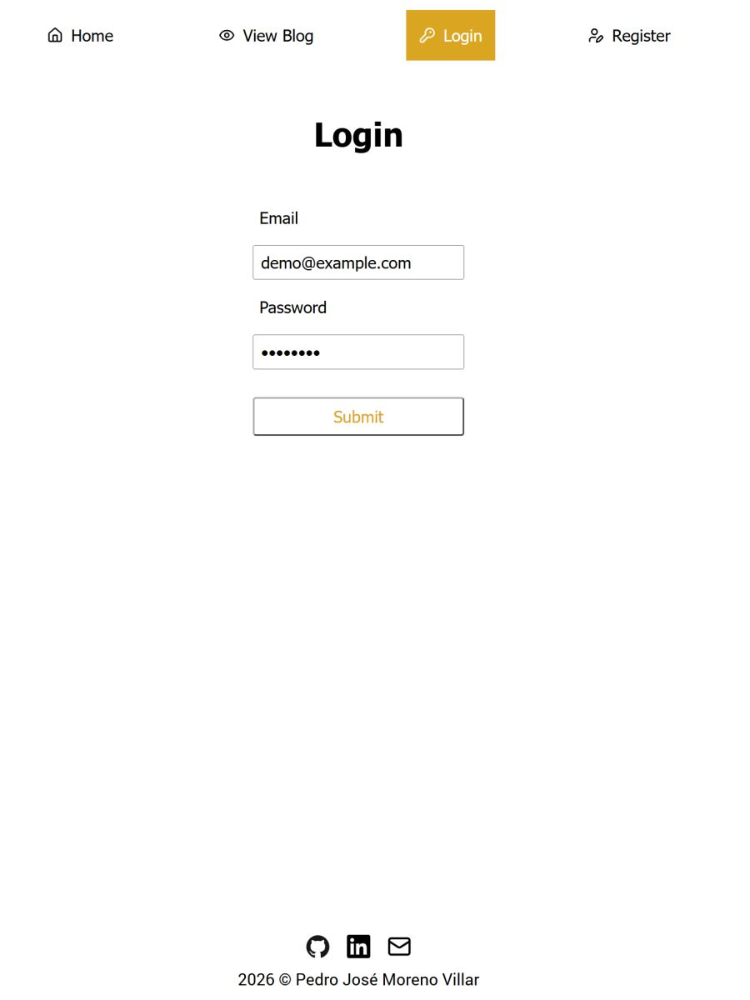
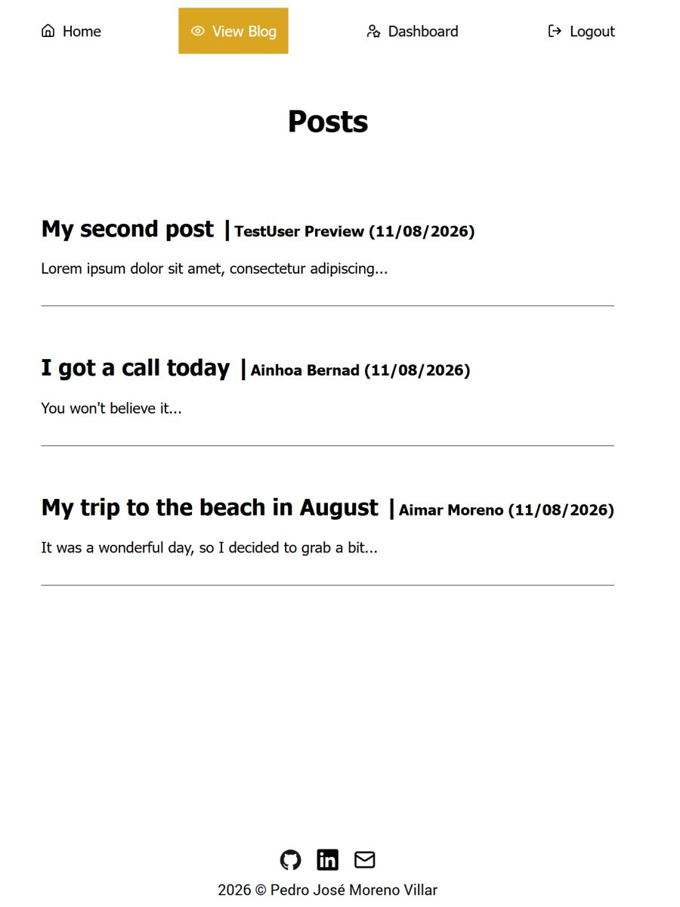

# Blog public client

React frontend for the full-stack blog platform. Provides public access to published posts and authenticated users with the ability to create and delete their own comments.

[Live Demo](https://blog-public-client-d222d34a08ef.herokuapp.com/) | Demo: `demo@example.com` / `demo1234`

See: [Backend API](https://github.com/pedromorenovillar/blog_backend?tab=readme-ov-file) • [Admin Client](https://github.com/pedromorenovillar/blog_admin-client)

| <br>Log in | <br>View posts | <br>Add comment | <br>Delete comment |
| ---------------------------------------------------- | ------------------------------------------------------------- | -------------------------------------------------------------------- | -------------------------------------------------------------------------- |

## Features

- **Post and comment access**: Browse published posts and create/delete your own comments
- **Client-side routing**: React Router handles navigation. State is managed via Context API
- **API client abstractions**: `/src/api` modules for auth, posts, comments
- **Authentication**: Access tokens are used for authenticated API requests; refresh tokens are managed through an HttpOnly backend cookie

## Tech Stack

- React 19, Vite, React Router 7
- Context API, Fetch API

## Setup

```bash
npm install
npm run dev          # Runs on http://localhost:5173
```

Point to a running [blog backend](https://github.com/pedromorenovillar/blog_backend) (see backend docs for setup).

## Context

Public client for The Odin Project's [Blog API assignment](https://www.theodinproject.com/lessons/node-path-nodejs-blog-api), backed by a shared Express REST API and paired with a separate admin client.